# At Home Psicologia - Online Psychology Platform
## Table of Contents
* [Technologies](#technologies)
* [Introduction](#introduction)
* [Features](#features)
* [Installation](#installation)
* [Usage](#usage)
* [Languages](#languages)

## Subpages
* [Home](#home)
* [Services](#services)
* [Booking](#booking)
* [Contact](#contact)
* [Blog](#blog)
* [Admin Panel](#admin-panel)
* [Footer](#Footer) 

## Technologies<a name="technologies"></a>
Django Framework, Python, Bootstrap, HTML, CSS, Git, GitHub

## Introduction<a name="introduction"></a>
Welcome to At Home Psicologia, your go-to online destination for accessing top-notch professional psychology services. This dynamic Django project is the culmination of our journey through the Python bootcamp at Software Development Academy, representing our commitment to enhancing mental well-being through accessible and user-friendly technology.
At Home Psicologia is more than just a digital platform; it's an innovative solution designed to streamline the process of connecting users with certified therapists. 

Our Minimum Viable Product (MVP) is a testament to our initial success, but rest assured, we are dedicated to continuous improvement and envision a future where mental health support is even more seamlessly integrated into your daily life.

## Features<a name="features"></a>
**1. Available public:**
+ Multi-language support: The website includes support for multiple languages, such as English and Spanish, with a language switcher available in the navbar.
+ Contact form: A contact form is provided with email confirmation functionality.
+ Blog: The platform features a blog section, allowing users to leave comments.
+ Responsive design: The website is designed to be responsive and user-friendly.

**2. For authenticated users:**
+ Booking and appointment editing system: Authenticated users can utilize a system for booking and editing appointments, with email confirmation.
+ E-Book downloads: Authenticated users have the option to download free E-Books directly from their user panel.
+ Review management: Authenticated users can leave, edit, and delete reviews.

**3. For admin:**
+ Easy appointment search and filtering: Administrators have access to a straightforward search and filtering system for managing all appointments.


## Installation<a name="installation"></a>
Please make sure your Python installation is at least version 3.11.2.
Clone the repository:
```
git clone https://github.com/zielu2021/dataload.git
```
Create a virtual environment:
```
python -m venv venv
```
Activate the virtual environment:

On Windows:
```
venv\Scripts\activate
```
On macOS/Linux:
```
source venv/bin/activate
```
Install dependencies: 
```
pip install -r requirements.txt
```
Update Email settings: 'athomepsicologia\settings.py:176'
```
EMAIL_BACKEND = 'django.core.mail.backends.smtp.EmailBackend'
EMAIL_HOST = 'your-smtp-host'
EMAIL_PORT = your-smtp-port     
EMAIL_HOST_USER = 'your-email@example.com'  
EMAIL_HOST_PASSWORD = 'your-email-password'
```
**Optional google auth** - You can proceed to next step:
```
To login with google account you need to configure and add to 'settings.py':
SOCIAL_AUTH_GOOGLE_OAUTH2_KEY
SOCIAL_AUTH_GOOGLE_OAUTH2_SECRET
```

Apply database migrations:
```
python manage.py migrate
```
Load initial data:
```
python manage.py loaddata initial_data.json
```
Run the development server:
```
python manage.py runserver
```
**Login as demouser**

username:
```
testuser
```
password:
```
testpassword123!
```

**To explore website as admin you need to create superuser**

**Create a superuser account:**
```
python manage.py createsuperuser
```


## Usage<a name="usage"></a>
Access the Django development server at http://127.0.0.1:8000/ and explore the different pages and functionalities.

## Languages<a name="languages"></a>
To alter the language setting, kindly utilize the language switcher adorned with a globe icon. Upon selection, users will have the option to switch between the Spanish and British flags. All content, inclusive of email confirmations and messages, is proficiently presented in both languages
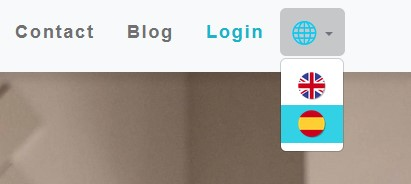


## Home<a name="home"></a>
Home section of our application's index page, where users can seamlessly navigate through a sophisticated interface. The top bar features strategically placed advertisements, accompanied by a navbar housing various subpages and a login button that gracefully transforms into a user dropdown post-authentication.

Our visually appealing carousel captures attention with three dynamically transitioning images, each accompanied by a corresponding call-to-action button. Immerse yourself in a blend of static and dynamically generated content, including the latest sliced blog post, compelling images, and the corresponding title.

For user engagement, we provide a seamless journey towards account creation and access to downloadable e-books through a thoughtfully placed button. Furthermore, five recent customer reviews dynamically appear in visually captivating slides, offering insights into our users' experiences.

Finally, our footer is a hub of connectivity, featuring essential page links and seamless integration with our social platforms. Explore, engage, and connect with us through this meticulously designed Home section, reflecting our commitment to a user-centric experience.

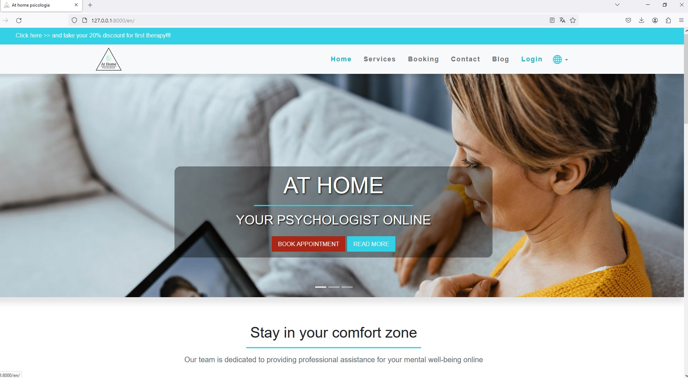
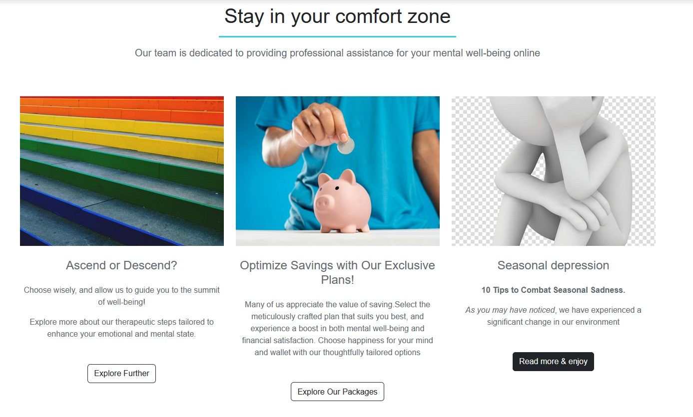
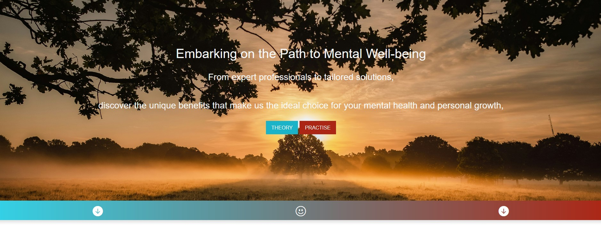
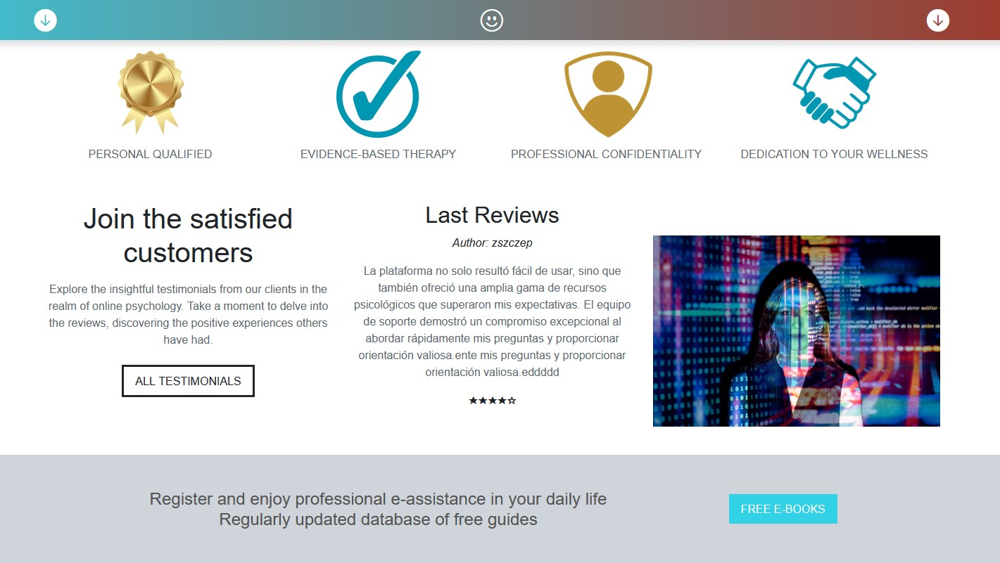
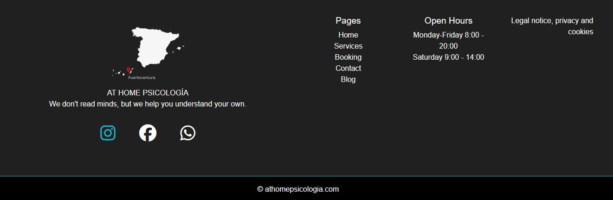

## Services<a name="services"></a>
The Services subpage describes the therapy process with accompanying images. A call button is provided for booking appointments.

## Booking<a name="booking"></a>
The Booking subpage features an intuitive booking system that empowers users to seamlessly schedule appointments. Within the user-friendly interface, individuals can effortlessly select a date from the upcoming three weeks, choose their preferred service (either individual or couples therapy), and opt for an available appointment time. Upon submission of the booking request, users receive a real-time on-screen confirmation, complemented by a professionally formatted email confirmation.

To enhance user flexibility, the system allows appointment edits up to 24 hours before the scheduled time, providing a convenient and efficient experience. This sophisticated booking functionality ensures a streamlined and reliable process for users seeking professional therapy services.

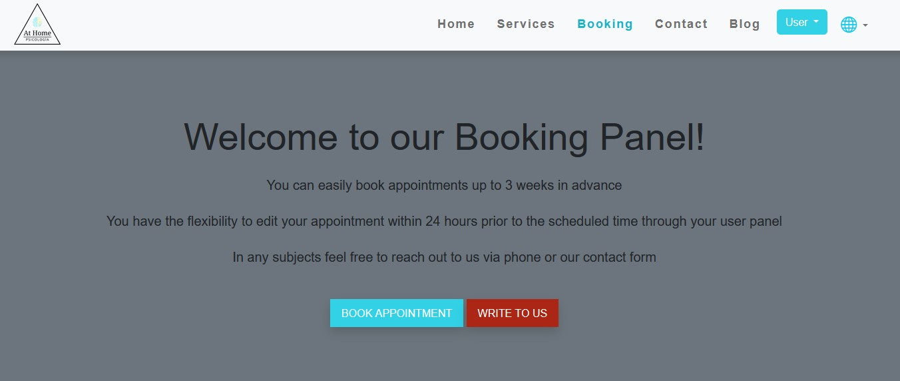
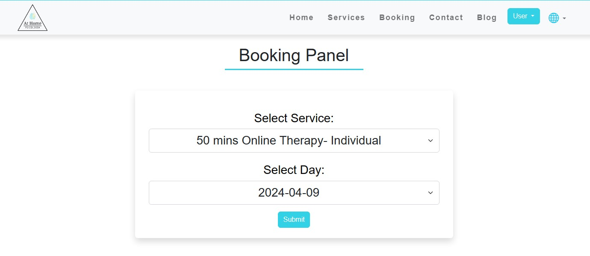
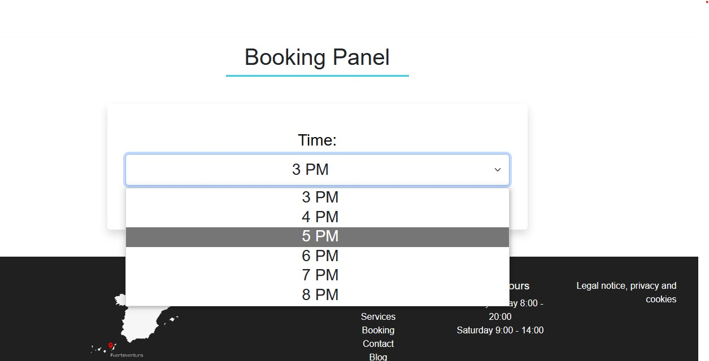
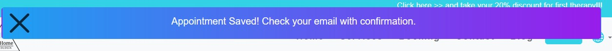

## Contact<a name="contact"></a>
The Contact subpage includes a contact form for general inquiries. Authenticated users see pre-filled name and email fields.

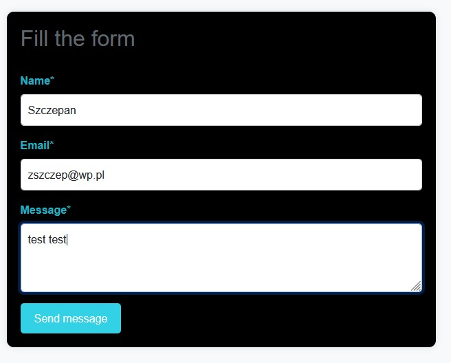

## Blog<a name="blog"></a>
The blog features a user-friendly interface that enables users to efficiently navigate through posts, either by sorting them chronologically from newest to oldest or by exploring specific categories. In each of these views, users have the capability to click on individual posts, redirecting them to a detailed view where they can access the complete content and engage by leaving comments. The administrative functionality empowers administrators to seamlessly add new posts, categories, style text and upload images through the Django admin panel.

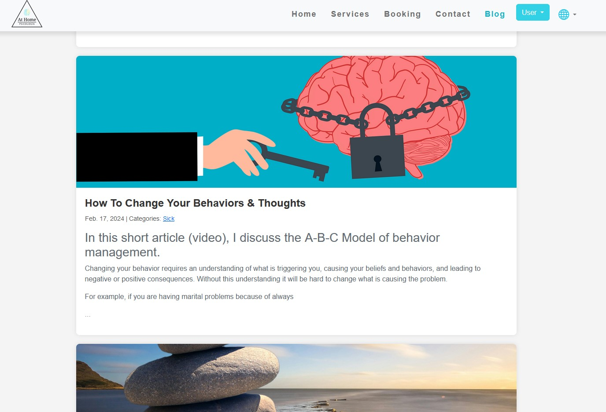
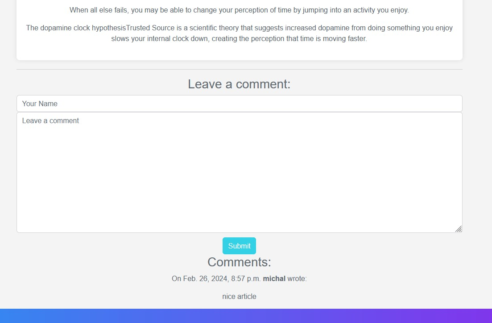

## Admin Panel<a name="admin-panel"></a>
Administrators have access to a dedicated panel that facilitates the oversight of current appointments, featuring convenient filtering options and a shortcut button for manually adding new appointments within the Django admin panel.

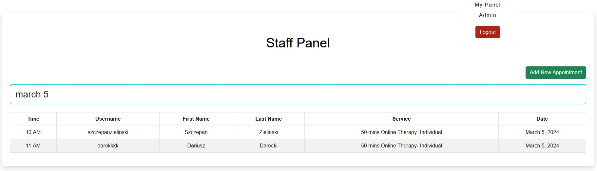


Feel free to explore, use, and contribute to At Home Psicologia! If you encounter any issues or have suggestions, please open an issue on our GitHub repository.
